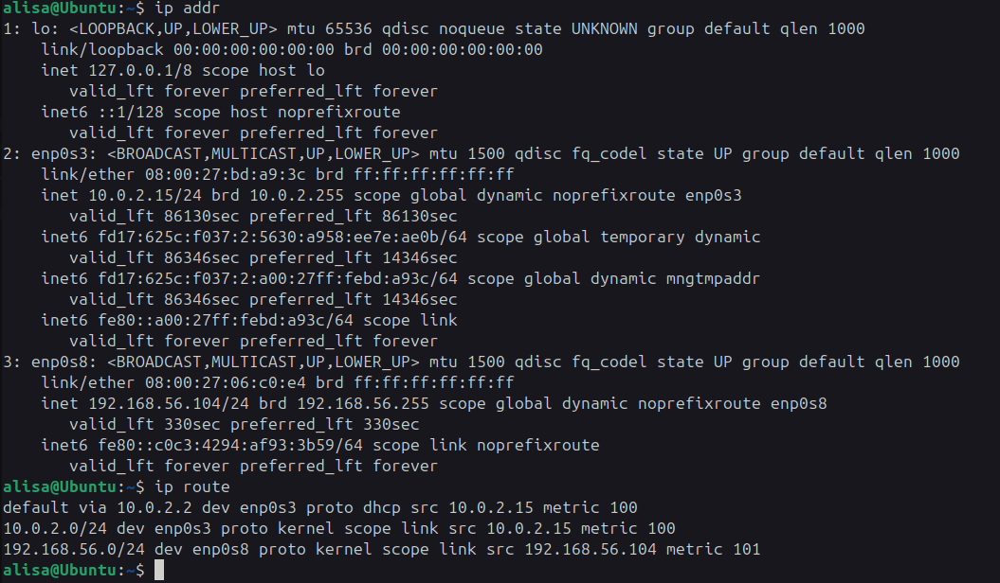
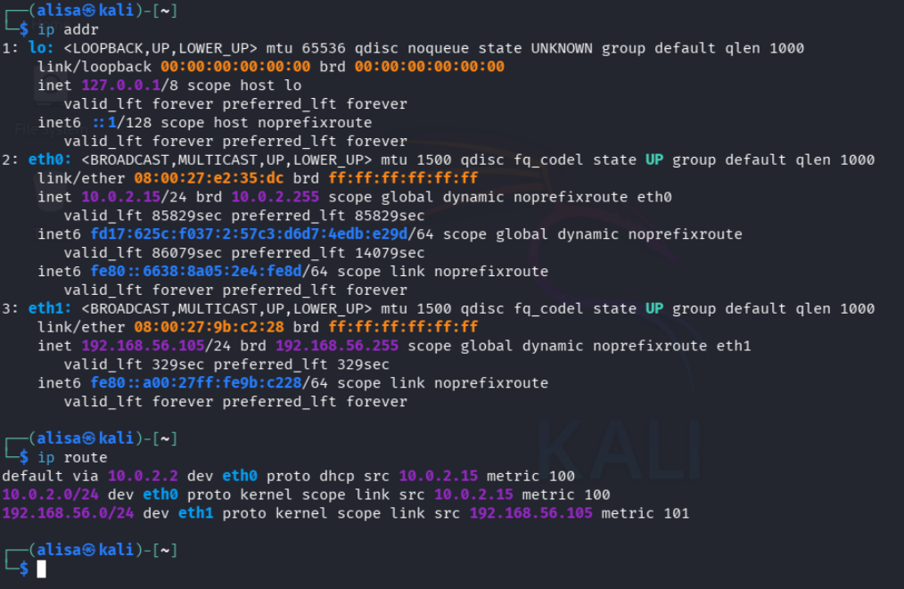
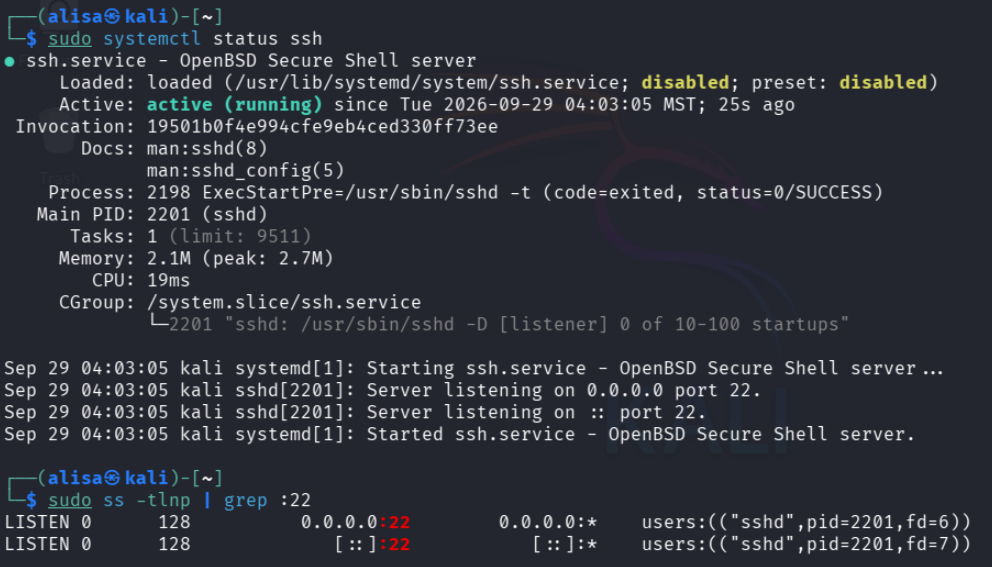
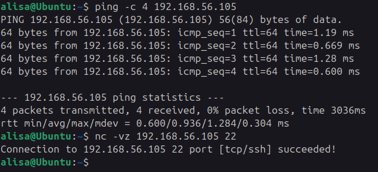
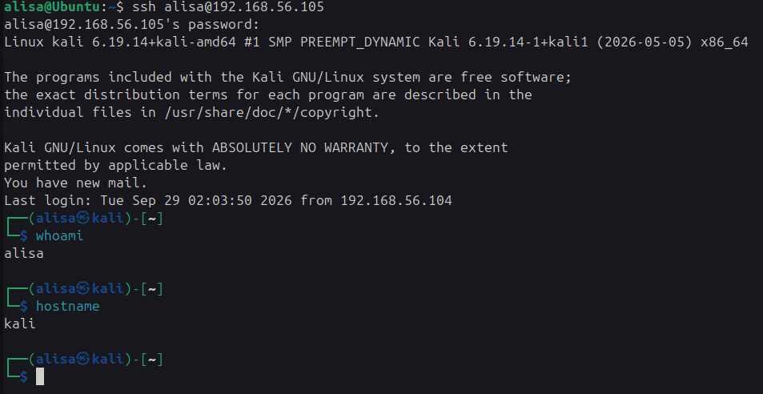
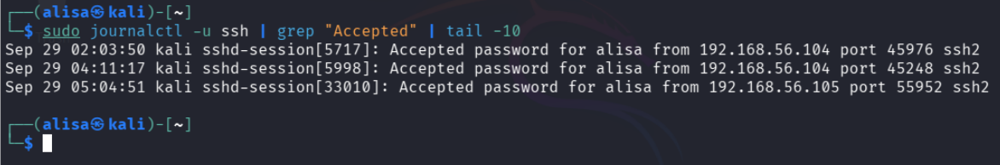
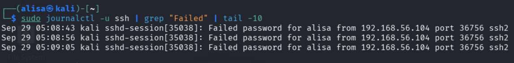
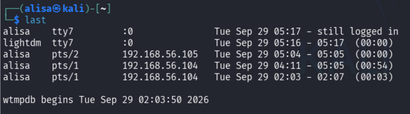
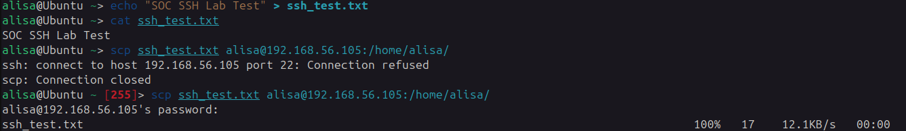
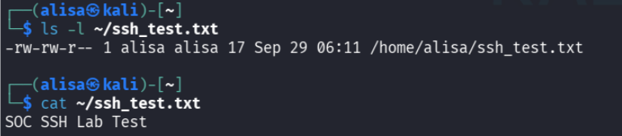

# SSH Authentication & Linux Log Analysis Lab

## Overview

This project demonstrates a small Linux-based security monitoring
and log analysis laboratory using two virtual machines.

The lab focuses on SSH authentication, Linux authentication logs,
failed login detection, login history, and secure file transfer
using SCP.

## Lab Environment

* VirtualBox
* Ubuntu Linux
* Kali Linux
* OpenSSH
* SCP

## Network Architecture

Ubuntu → Kali

SSH communication:
TCP/22

## Objectives

* Configure and verify SSH connectivity
* Perform successful SSH authentication
* Generate failed authentication events
* Analyze Linux authentication logs
* Identify source IP addresses and usernames
* Review login history
* Transfer a file using SCP
* Document security-relevant observations

## Investigation

### 1. Network Configuration

The network configuration of both virtual machines was verified
before establishing the SSH connection.

#### Ubuntu

#### Kali Linux

### 2. SSH Service

The SSH service on the Kali Linux virtual machine was started
and its status was verified.

### 3. SSH Connectivity Test

Connectivity to the SSH service was tested over TCP port 22.

### 4. Successful SSH Authentication

A successful SSH login from Ubuntu to the Kali Linux SSH server
was performed and verified.

### 5. Authentication Log Analysis

The successful SSH authentication event was reviewed in the
Kali Linux authentication logs.

### 6. Failed SSH Authentication

Several failed SSH authentication attempts were intentionally
generated for testing purposes.

The resulting authentication events were reviewed in the
Kali Linux logs.

### 7. Login History

The login history was reviewed to identify recorded user
sessions and authentication activity.

### 8. Secure File Transfer

A file was transferred between the virtual machines using SCP.

## Security Observations

The authentication logs provide several fields that are useful
for security monitoring:

* timestamp
* username
* source IP address
* destination service
* authentication result

Repeated failed SSH authentication attempts from the same
source may warrant further investigation in a real environment.

In this laboratory, the failed attempts were intentionally
generated for testing purposes.

## Conclusion

This laboratory provided practical experience with SSH
authentication, Linux authentication logs, failed login
detection, login history, and SCP file transfer.

The project demonstrates a basic workflow for collecting and
reviewing authentication-related security events in a Linux
environment.
